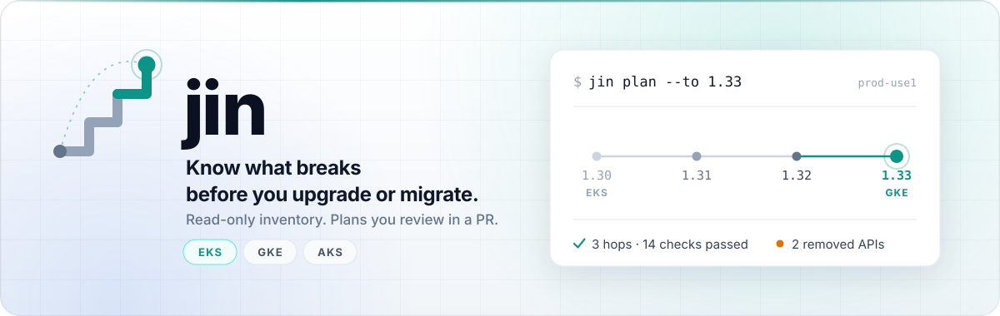
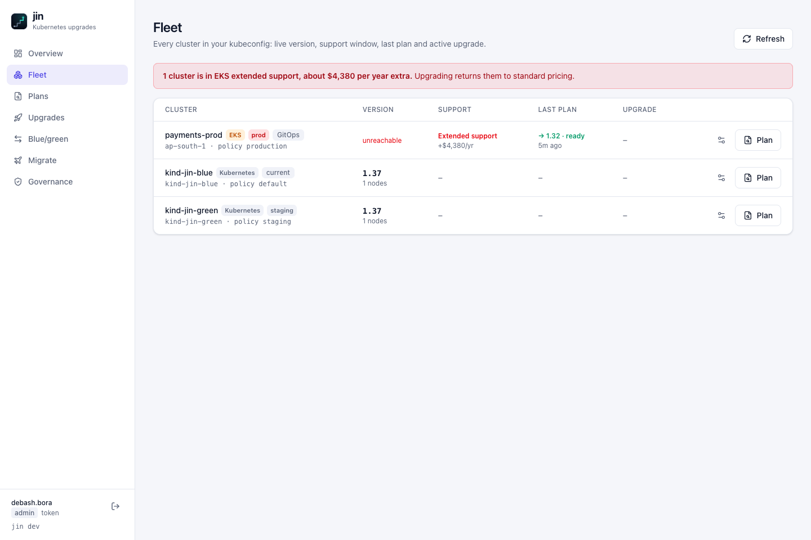
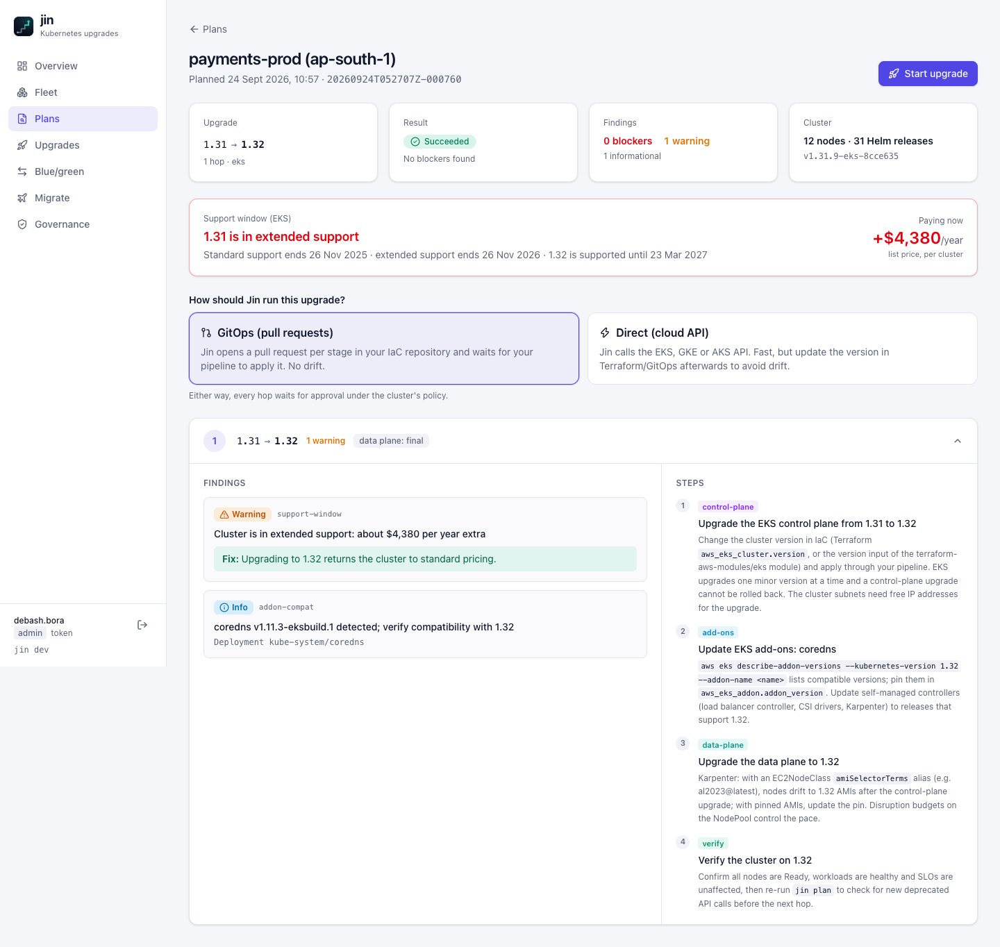
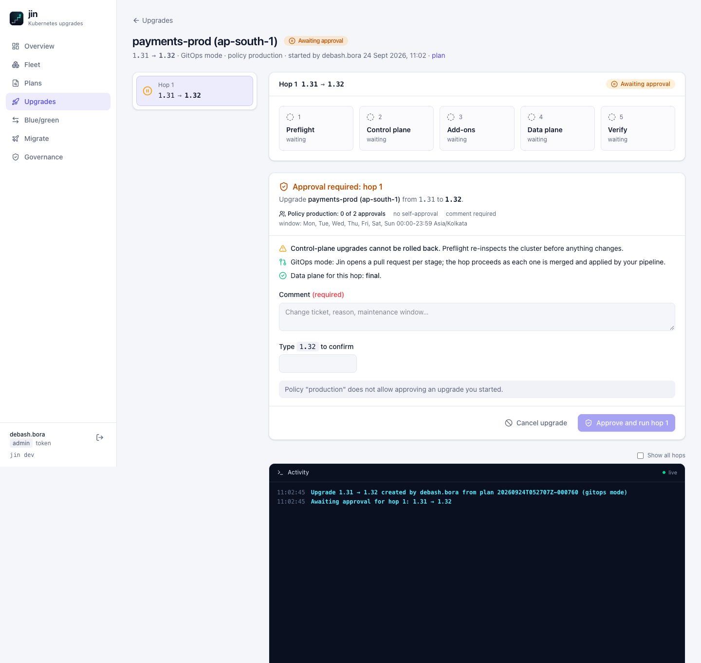
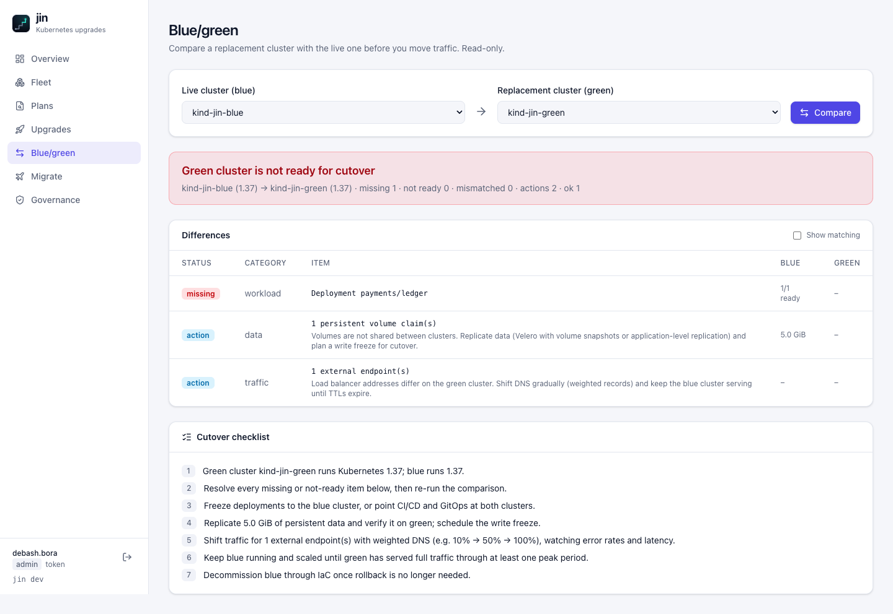
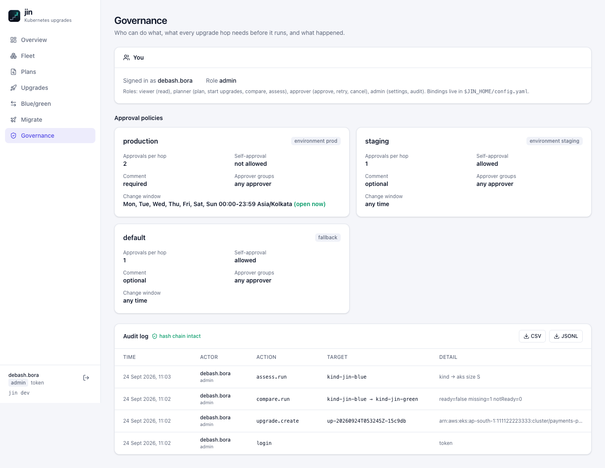
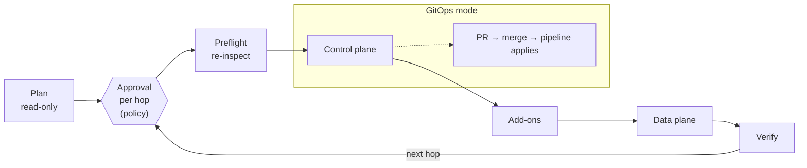
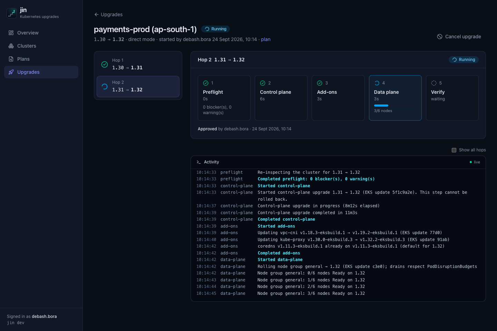
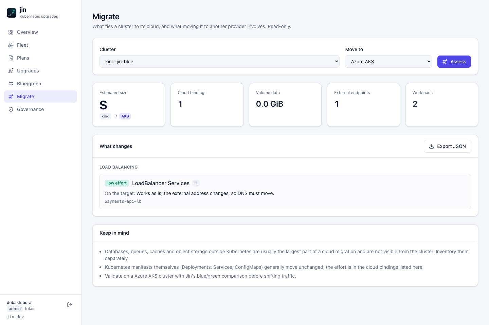

<p align="center">
  <picture>
    <source media="(prefers-color-scheme: dark)" srcset="docs/assets/jin-banner-dark.svg">
    
  </picture>
</p>

<p align="center">
  <a href="https://github.com/jin-k8s/jin/actions/workflows/ci.yml"></a>
  <a href="LICENSE"></a>
  
  
  
</p>

<p align="center">
  <b>Jin plans Kubernetes upgrades hop by hop, finds what breaks before it breaks, and runs them<br>
  through pull requests or the cloud API with a human approval before every hop.</b><br>
  EKS · GKE · AKS · blue/green cutovers · cross-cloud migration · SSO, RBAC, approval policies and audit.
</p>

<p align="center">
  <a href="#quick-start">Quick start</a> ·
  <a href="#features">Features</a> ·
  <a href="#how-upgrades-run">How upgrades run</a> ·
  <a href="#teams-and-governance">Teams</a> ·
  <a href="#security">Security</a> ·
  <a href="#status">Status</a>
</p>

---

<p align="center">
  
</p>

## Why Jin

Every EKS, GKE and AKS team upgrades several times a year. Each upgrade costs days of manual work:
finding removed APIs in Helm charts, checking add-on compatibility, working out node version skew,
chasing PodDisruptionBudgets that stall drains, then babysitting the control plane, add-ons and node
pools one minor version at a time. Clusters that fall behind cost money: EKS extended support is billed
at **$0.60 instead of $0.10 per cluster-hour**, about **$4,380 per cluster per year**.

Jin turns that into one repeatable, auditable flow, and extends it to blue/green cluster moves and
cross-cloud migrations.

## Quick start

```sh
git clone https://github.com/jin-k8s/jin && cd jin
make build              # builds the web UI and embeds it in bin/jin (Go 1.27+, Node 24+)

bin/jin plan            # read-only plan for your current kube context
bin/jin server --open   # web UI at http://localhost:7420
```

## Features

| | |
|---|---|
| **Plan** | Read-only inspection of the cluster. Every hop to the target, with blockers, warnings and ordered steps: removed APIs (Helm and `kubectl apply` sources), deprecated API calls, version skew, drain blockers, add-ons. |
| **Support calendar** | EKS support status, end-of-support dates and the **extended-support surcharge**, per cluster and across the fleet. |
| **GitOps mode** | Jin edits your Terraform or YAML sources, opens **one pull request per stage**, waits for the merge and for your pipeline to apply it, then verifies. No drift. |
| **Direct mode** | Jin drives the **EKS, GKE or AKS API**: control plane, managed add-ons, node pools, Karpenter / Auto Mode, with live per-node progress. |
| **Human in the loop** | Every hop waits for approval. Policies can require two approvers, forbid self-approval, require a change ticket, restrict approver groups and enforce change windows. |
| **Blue/green** | Compare a replacement cluster with the live one: workloads and readiness, Helm releases, CRDs, storage and ingress classes, secret backends. Get a data and traffic cutover checklist. |
| **Migrate** | Assess what ties a cluster to its cloud (IRSA / Workload Identity, disks, load balancers, ingress, registries, secret stores, scheduling labels, cloud operators) and what each maps to on the target cloud, with an effort estimate. |
| **Fleet** | Every cluster at a glance: live version, support window and cost, last plan, active upgrade, governing policy. |
| **Teams** | OIDC single sign-on, RBAC (viewer, planner, approver, admin), and a hash-chained audit log exportable as CSV or JSONL. |

Everything is open source under Apache-2.0: there is no enterprise edition.

<table>
  <tr>
    <td></td>
    <td></td>
  </tr>
  <tr>
    <td></td>
    <td></td>
  </tr>
</table>

## How upgrades run



Each stage runs through one of two executors:

| | GitOps mode | Direct mode |
|---|---|---|
| How the cluster changes | Your pipeline applies a merged pull request | Jin calls the EKS, GKE or AKS API |
| Sources supported | Terraform (resources and registry modules, following `var.*` / `local.*` into tfvars and defaults), eksctl, ACK, Crossplane, Helm values, Argo CD apps | – |
| IaC drift | None | Update your sources afterwards |
| Waits for | Review, merge, then the cluster reaching the new version | Cloud operations to finish |
| Credentials | GitHub token in the server environment | Cloud credentials (see [`deploy/iam`](deploy/iam/README.md)) |

Jin finds version fields in the repository itself (**Fleet → settings → Discover**) and edits them
without disturbing comments or formatting. Branches are deterministic, so a restarted Jin resumes the
same pull request instead of opening another.

**Stages.** Preflight re-inspects the cluster and stops on drift or unresolved blockers. The control
plane moves one minor version per hop. Add-ons move to the provider's default for the new release;
they are never downgraded, and custom configuration is preserved. Node pools roll only when the skew
policy requires it (or on the last hop). Verify checks the API server version, node readiness and skew,
and system workloads.

<p align="center">
  
</p>

## Blue/green and migration

```sh
jin compare --context prod-blue --to prod-green    # parity check before a cutover
jin assess  --context prod-eks  --to gke           # what moving to GKE involves
```

Both are read-only and available in the UI. The assessment is honest about scope: databases, queues
and object storage outside Kubernetes are usually the biggest part of a migration and are not visible
from the cluster.

<p align="center">
  
</p>

## Teams and governance

Configure SSO, roles and approval policies in `$JIN_HOME/config.yaml`. A complete example is in
[`docs/config.example.yaml`](docs/config.example.yaml):

```yaml
auth:
  oidc: {issuer: https://login.example.com, clientID: jin, redirectURL: https://jin.example.com/auth/callback}
rbac:
  bindings:
    - {role: approver, subjects: ["group:sre"]}
policies:
  - name: production
    match: {environments: [prod]}
    minApprovals: 2
    forbidSelfApproval: true
    requireComment: true
    windows: [{days: [Tue, Wed, Thu], start: "10:00", end: "16:00", timezone: Asia/Kolkata}]
```

| Role | Can |
|---|---|
| viewer | see everything |
| planner | plan, start upgrades, compare, assess |
| approver | approve, retry, cancel hops |
| admin | cluster settings, GitOps configuration, audit export |

Every sign-in, plan, approval, denial, retry, cancellation and settings change is written to a
hash-chained audit log. Editing or deleting a line is detected, and **Governance** shows whether the
chain is intact.

## Safety model

- **Nothing changes without approval.** Each hop needs its own approval, the approver types the target version, and blocker overrides need a written justification.
- **Policies are enforced by the server**, not just the UI: approver count, separation of duties, required groups and change windows (including windows that cross midnight or use time zones).
- **Drift is detected.** Preflight stops if the cluster is not on the version the hop starts from.
- **One upgrade per cluster.** A second upgrade cannot start while one is awaiting approval, running or failed.
- **Resumable and idempotent.** Every stage checks the current state first and attaches to cloud operations or pull requests already in flight.
- **Honest about uncertainty.** Incomplete data is flagged, and hops beyond Jin's verified API-removal data carry a warning.

## Security

- **Planning, compare and assess are read-only.** The least-privilege ClusterRole is [`deploy/rbac/jin-readonly.yaml`](deploy/rbac/jin-readonly.yaml). Jin decodes only Helm release secrets, and keeps nothing but `apiVersion/kind/name` from them; use `--skip-helm` to avoid granting Secret access.
- **Scoped cloud permissions.** See [`deploy/iam`](deploy/iam/README.md) for EKS, GKE, AKS and GitHub token scopes.
- **Secrets stay in the environment.** OIDC client secrets and GitHub tokens are read from environment variables and never written to disk. Token variables must be named `GITHUB_*` or `JIN_GITHUB_*`, and repositories must live on github.com or an allowlisted GitHub Enterprise host, so settings cannot redirect a secret elsewhere.
- **Sign-in.**
  - OIDC authorization-code flow with PKCE, state and nonce, and verified ID tokens.
  - Verified email and allowed domains are enforced.
  - Sessions are HMAC-signed cookies (`HttpOnly`, `SameSite=Lax`, `Secure` over TLS). Roles are re-evaluated on every request.
- **Web hardening.**
  - A custom header is required on every write (CSRF).
  - The server rejects foreign `Host` headers on loopback (DNS rebinding) and sends a strict Content-Security-Policy.
  - Audit CSV exports neutralise spreadsheet formulas.

Run the server behind TLS when it is not on localhost.

## CLI

| Command | Purpose |
|---|---|
| `jin plan [--target 1.33] [-o table\|markdown\|json] [--fail-on-blockers] [--skip-support]` | Plan an upgrade (read-only) |
| `jin server [--listen 127.0.0.1:7420] [--open]` | Web UI, upgrade engine, SSO and audit |
| `jin compare --context BLUE --to GREEN [-o json]` | Blue/green parity check |
| `jin assess --to eks\|gke\|aks [-o json]` | Cross-cloud migration assessment |
| `jin runs list` / `jin runs show <id>` | Recorded plan runs |

Global flags: `--kubeconfig`, `--context`.

## Status

Jin is **alpha**. Test cluster-changing features on non-production clusters first.

| Area | State |
|---|---|
| Planning, support calendar, blue/green, migration assessment | Tested against live Kubernetes (kind) and in unit tests |
| Upgrade engine, approvals, policies, SSO, RBAC, audit | Tested end to end, including SSO against a standards-compliant test identity provider |
| EKS, GKE and AKS direct executors, GitHub GitOps executor | Tested against faithful API simulations; **validation on real accounts is in progress** |

Next: validation on real EKS, GKE, AKS and GitHub accounts; GitLab and Bitbucket; verified
compatibility data for common add-ons and API removals after 1.32.

## Development

```sh
make build     # UI + Go binary
make test      # Go tests (race detector) + UI type-check
make lint      # golangci-lint v2
make e2e       # end to end against a throwaway kind cluster (Docker, kind, jq)
make ui-dev    # Vite dev server with hot reload, proxying to `jin server` on :7420
```

Architecture and conventions are in [`CLAUDE.md`](CLAUDE.md). Issues and pull requests are welcome.

## License

[Apache License 2.0](LICENSE)
